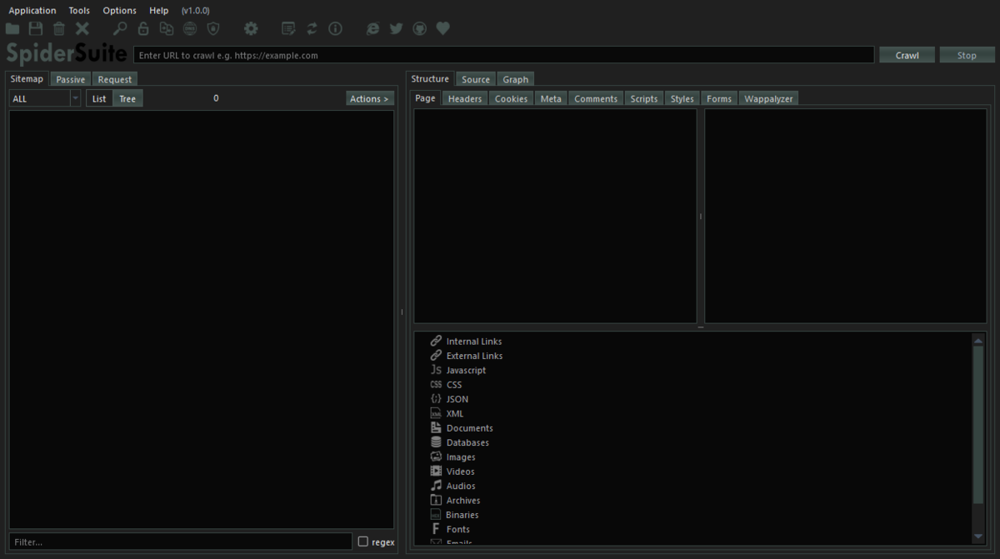

<!-- 

-->

 

An advance cross-platform and multi-feature GUI web spider/crawler for cyber security proffesionals. Spider Suite can be used for attack surface mapping and analysis.
For more information visit SpiderSuite's [website](https://SpiderSuite.github.io).

# Installation and Usage
Spider Suite is designed for easy installation and usage even for first timers.

- First, [download](https://github.com/3nock/SpiderSuite/releases) the package of your choice.

- Then [install](https://github.com/3nock/SpiderSuite/wiki/Installation) the downloaded SpiderSuite package.

- See [First time crawling with SpiderSuite](https://spidersuite.github.io/tutorial/2023/04/22/beginner-guide/) article for tutorial on how to get started.

For complete documentation of Spider Suite see [wiki](https://github.com/3nock/SpiderSuite/wiki).

# Contributing 

_**Are you a developer?**_

Check out the [open issues](https://github.com/3nock/SpiderSuite/issues).

_**Not a developer?**_

You can help by reporting [bugs](https://github.com/3nock/SpiderSuite/issues), requesting new [features](https://github.com/3nock/SpiderSuite/issues), improving the [documentation](https://github.com/3nock/SpiderSuite/wiki), [sponsoring](SPONSOR.md) the project & writing articles and blog-posts.

For More information see [contribution guide](CONTRIBUTING.md).

**Contributers**

- [3nock](https://twitter.com/3nock_) (main developer)

# Credits

This product includes software developed by the following open source projects:
- Google's [Gumbo HTML Parser](http://github.com/google/gumbo-parser)
- Google's [Protocal bufffers](https://github.com/protocolbuffers/protobuf)
- SQLite database [library](https://sqlite.org)
- Graphviz [library](https://graphviz.org)
