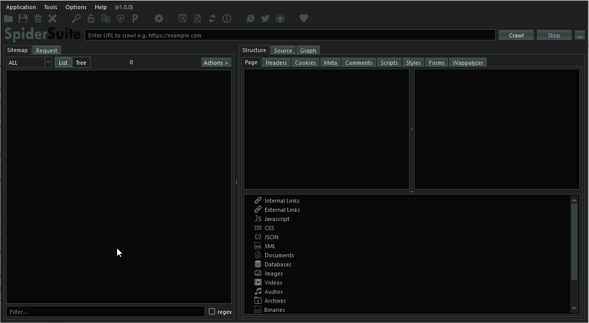

    

    
    
    
    

An advance cross-platform and multi-feature GUI web spider/crawler for cyber security proffesionals. Spider Suite can be used for attack surface mapping and analysis.
For more information visit SpiderSuite's [website](https://SpiderSuite.github.io).

# Installation and Usage
Spider Suite is designed for easy installation and usage even for first timers.

- First, [download](https://github.com/3nock/SpiderSuite/releases) the package of your choice.

- Then [install](https://github.com/3nock/SpiderSuite/wiki/Installation) the downloaded SpiderSuite package.

- See [First time crawling with SpiderSuite](https://spidersuite.github.io/tutorial/2023/04/22/beginner-guide/) article for tutorial on how to get started.

For complete documentation of Spider Suite see [wiki](https://github.com/3nock/SpiderSuite/wiki).

# Contributing 

_**Can you translate?**_

Visit [SpiderSuite's translation project](https://crowdin.com/project/spidersuite) to make translations to your native language.

_**Not a developer?**_

You can help by reporting [bugs](https://github.com/3nock/SpiderSuite/issues), requesting new [features](https://github.com/3nock/SpiderSuite/issues), improving the [documentation](https://github.com/3nock/SpiderSuite/wiki), [sponsoring](SPONSOR.md) the project & writing articles.

For More information see [contribution guide](CONTRIBUTING.md).

# Sponsors

WebSec BV, a cybersecurity company based in Amsterdam, is recognized for their dedication to helping businesses and individuals protect themselves against online threats. As a valued sponsor, they have contributed significantly to the promotion of cybersecurity and the creation of a safer online world.

WebSec's team of professionals is committed to staying ahead of the latest threats and developing cutting-edge solutions to keep their clients protected. Their passion for cybersecurity education has made them a trusted and reliable partner in the industry.

Through their sponsorship and support, WebSec has demonstrated their commitment to promoting cybersecurity awareness and helping people stay safe online. Their contributions are greatly appreciated and have made a significant impact on the work being done in this field, such as making this project a reality.

Overall, WebSec BV is a trusted and respected leader in the fight against cybercrime, and their sponsorship and support have been instrumental in promoting a safer online world. They are a valued partner and their contributions to this important work are truly appreciated.

Website: [websec.nl](https://websec.nl)

Blog: [websec.nl/blog](https://websec.nl/blog)

# Credits

This product includes software developed by the following open source projects:
- Google's [Gumbo HTML Parser](http://github.com/google/gumbo-parser)
- Google's [Protocal bufffers](https://github.com/protocolbuffers/protobuf)
- SQLite database [library](https://sqlite.org)
- Graphviz [library](https://graphviz.org)
