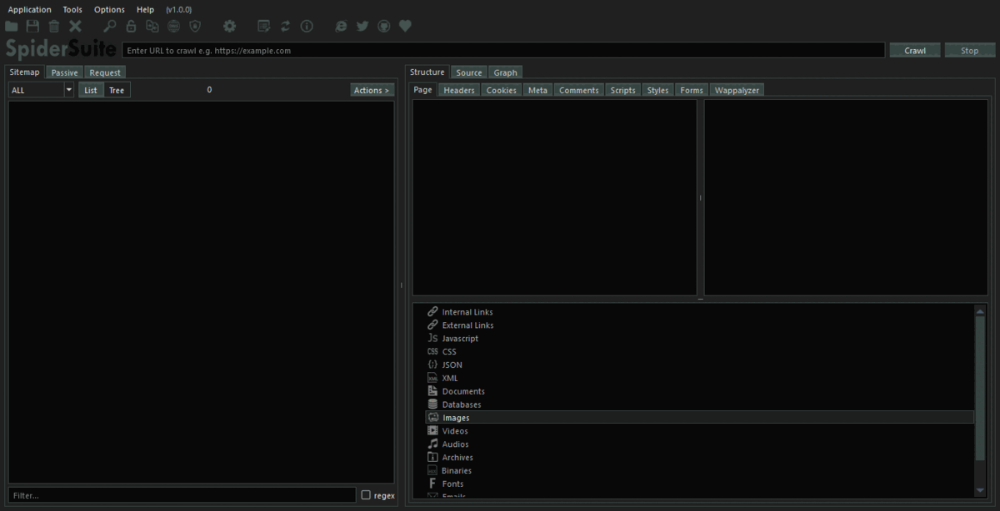

 

# SpiderSuite

Spider Suite is an advance cross-platform web spider/crawler for cyber security proffesionals. 
For more information checkout the [documentation](https://github.com/3nock/SpiderSuite/wiki)

## Features

## Preface

If you're just getting started with web crawling/spidering, osint information gathering & attack surface mapping, read [primer guide](PRIMER.md).

## Contributing 

**Are you a developer?** Check out the [open issues](https://github.com/3nock/SpiderSuite/issues).

**Are you a designer?** You can help design an even more intuitive UI, Logos & Icons.

**Not a developer?**
You can help by reporting [bugs](https://github.com/3nock/SpiderSuite/issues), requesting [features](https://github.com/3nock/SpiderSuite/issues), improving the [documentation](https://github.com/3nock/SpiderSuite/wiki), [sponsoring](SPONSOR.md) the project, writing blog posts & sharing this project to peers.

For More information see [contribution guide](CONTRIBUTING.md).

## Developers

- [3nock](https://twitter.com/3nock_)